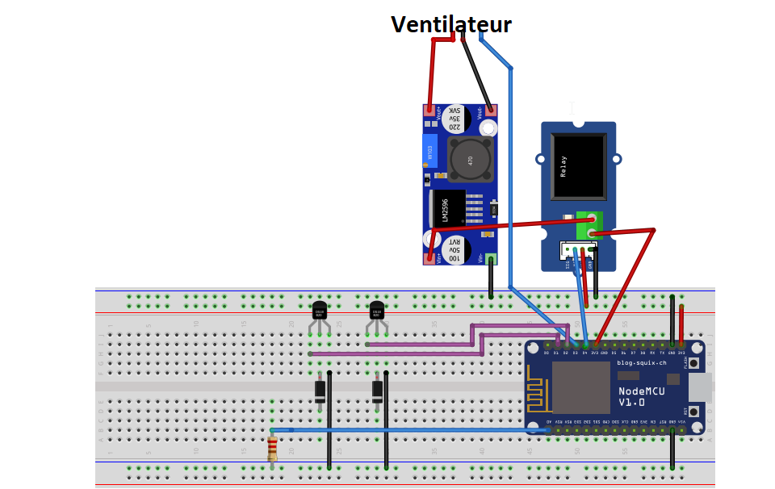

# Can Heater

The purpose of this project is to remotely control a solar heater made of recycled cans using an ESP8266 to control air flow through a fan and send temperature sensors' data to a server.

The server manage all the treatment of incoming data, store them in a database and provides a REST API (using [Express.js](http://expressjs.com/fr/)) for the client application.

The client application interface is composed of multiple modules to see the state of the can heater and allow the user to manage the temperature.

The project is therefore divided in three parts called *Server*, *Client* and *Board*.

## Getting Started

These instructions will get you a copy of the project up and running on your local machine for development and testing purposes. See deployment for notes on how to deploy the project on a live system.

### Prerequisites

Clone the Git respository `git clone https://github.com/CansHeater/CansHeater.git`.

Install [npm](https://www.npmjs.com/).

Electronic components required :
* 2 temperature sensors (we use [those ones](http://wiki.seeedstudio.com/Grove-Temperature_Sensor_V1.2/))
* A PWM Fan (Recycled from an old computer)
* A DC-DC booster (To make the fan operate at its optimum voltage. Optionnal if you have the adequate alimentation, we use [this one](https://www.sunrom.com/p/step-up-dc-dc-based-on-xl6009))
* A relay (To make the fan stops completely, we use [this one](https://www.generationrobots.com/fr/401812-grove-relais.html))
* A 1K resistance
* 2 diodes

### Installing

#### Server

Install node 9.x :
```
curl -sL https://deb.nodesource.com/setup_9.x | sudo -E bash -
sudo apt-get install -y nodejs
```

Place yourself into the *back* folder then simply run `npm install`.

#### Client

Place yourself into the *front* folder then run `npm install`.

Note that you may want to change the server IP address in the _front/src/app/sensors-data.service.ts_ and _front/src/app/heater-management.service.ts_ files.

#### Board

Install PlatformIO Atom plugin.

In PlatformIO Home page, select Board on the left panel and search for *ESP12E*. Click on install.

Multiple wiring are required in order to connects all sensors and the fan. See diagram below :



End with an example of getting some data out of the system or using it for a little demo

Note that you will have to set your server IP address and wifi credentials in the _esp/src/main.cpp_ file.

## Deployment

#### Server

To run the server, just use `node back/server/index.js`. It will tell you the port it's running on.

#### Client

To launch the client application, run `npm start` (or `ng serve` if you have installed Angular CLI). Access the application by typing '[http://localhost:4200](http://localhost:4200)' in your web browser.

Note that this commands starts a dev server. If you want to get the application for production, you may want to build it with, for example, `ng build --prod`.

#### Board

Load the project from Board folder, modify the program to set up your own Wifi credentials and server's IP and port then compile and upload to the card. Make sure to set writing rights on concerned USB port before uploading :

```
sudo chmod a+rwx /dev/ttyUSB0
```
To access to the Serial Monitor, click on *Serial Monitor* from PlatformIO menu and choose a Baudrate of 115200.
Now you can see the information the board is giving !

## Built With

#### Server

* [NodeJS](https://nodejs.org/en/) - Back-end JavaScript Runtime environnement

#### Client

* [Angular](https://angular.io/) - Client framework used

#### Board

* [PlatformIO](https://platformio.org/) - Used to compile and upload C++ code onto the board

## Authors

This project was carried out by ESIR engineering school students.
